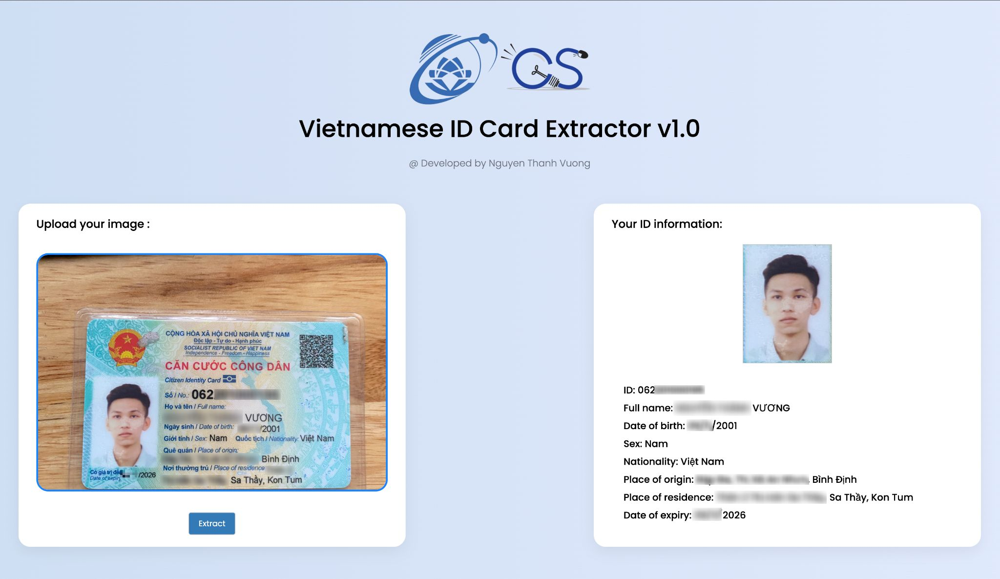

# **Vietnamese ID Card Extractor v1.0**
## **❗Newer version**

Checkout [**ID Card Extractor v2.0**](https://github.com/ntvuongg/vnese-id-extractor-v2)

## NOTICE
**This repository is no longer actively maintained.**

What does this mean?
This repository is not being actively updated, and issues and pull requests may not be addressed. The code and resources provided may be outdated and might not be compatible with the latest software libraries and dependencies.

Why is it no longer maintained?
There could be various reasons for discontinuing maintenance, including changes in project priorities, lack of resources, or the completion of the project's goals.

Can I still use the code or resources here?
Certainly! You are welcome to use the code and resources in this repository as a reference or starting point for your own projects. However, please be aware that there may be better alternatives or updated versions available elsewhere.

Looking for alternatives?
If you're seeking actively maintained alternatives or similar projects, consider searching on GitHub or other platforms, as there may be more up-to-date options to meet your needs.

Thank you for your interest in this repository, and we appreciate your understanding regarding its maintenance status.
## **Introduction**

An ID Card extraction tool using **Keras** models which is implementation of [**YOLOv4**](https://github.com/AlexeyAB/darknet) (Tensorflow backend) for detection and [**VietOCR**](https://github.com/pbcquoc/vietocr) for recognition.

## **Tutorial**

I highly recommend you performing on virtual environment by using [**Anaconda**](https://docs.anaconda.com/anaconda/install/index.html).

### **Activating your virtual environment**

```
conda activate [your_venv_name]
```

### **Cloning repository**

```
git clone https://github.com/ntvuongg/vnese-id-extractor.git
```

### **Installing requirements**

```
while read setup; do conda install --yes $setup || pip install $setup || conda install --yes -c  $setup $setup; done < setup.txt
```

### **Getting weights**

You can [click here](https://drive.google.com/drive/folders/1CDiN1Ogq1h4VzOQG5eqLh4eEuP065bWj?usp=sharing) to download my trained weights or get it from **gdown** module:

(You can pass below code if you have already installed **gdown**)

```
conda install gdown
```

```
gdown --id 1dAK75XvXP8L32FoSc1W3fFnt80Z32f1L
```

After downloaded weights, make sure you extract and put them in **_`vnese-id-extractor/models/weights`_**

### **Extracting your ID card**

```
conda run -n [your_venv_name] --no-capture-output --live-stream python vnese-id-extractor/deploy.py
```

First time running this will take a lot of time. So, keep waiting :)

When server is ready, you can extract your ID card by accessing below:

```
http://127.0.0.1:5000/
```

You can drag and drop or browse your image to drag area.

After uploaded your image of ID Card, click **Extract** button to get information from ID card.


